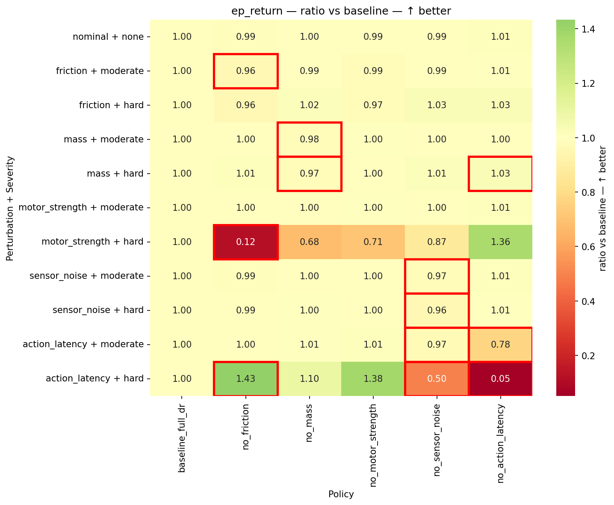
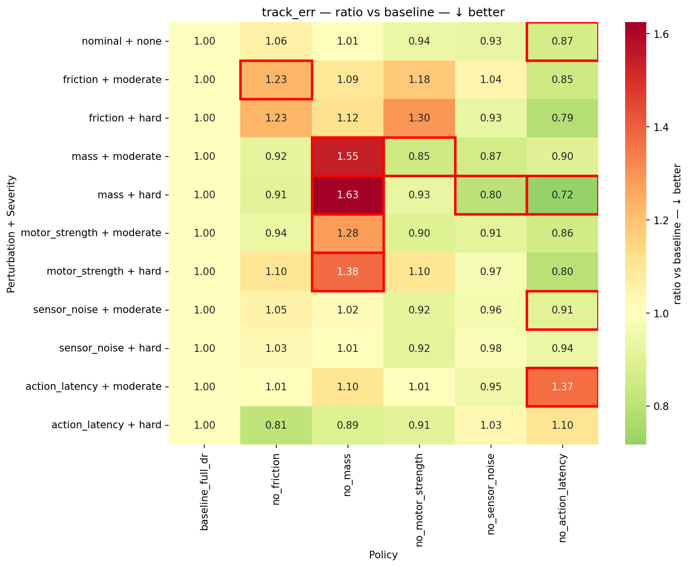
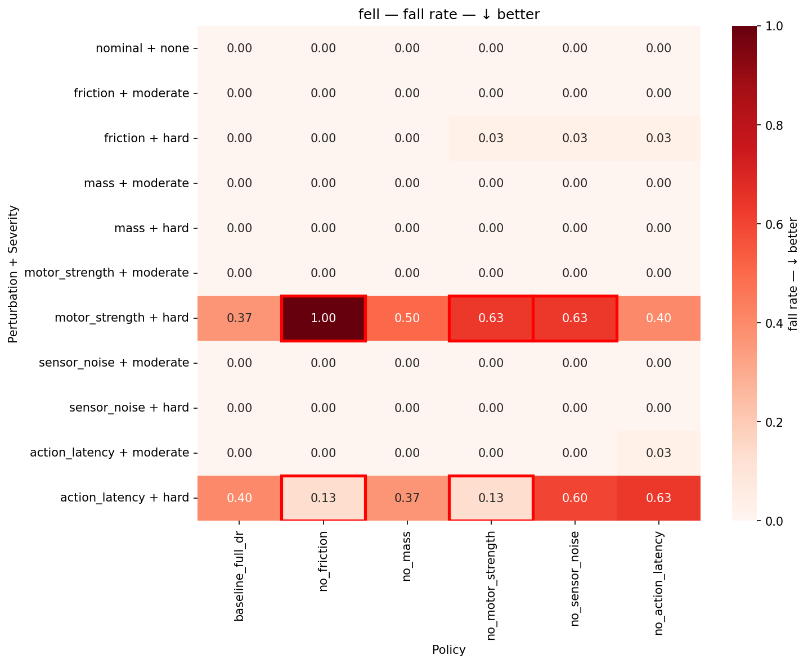

# Domain randomization ablation study for reinforcement learning in quadruped locomotion

Looking at robot demonstrations, it was pretty funny to see how violent some of them have become — robots getting kicked from every direction, pushed over, and even having their legs or arms damaged. At the same time, these demonstrations are incredibly impressive because they show just how robust modern locomotion policies have become, with robots recovering from very large perturbations. They also made me wonder - which perturbations do robots actually need to experience during training to become robust in the real world? To test this, I trained the Unitree Go2 quadruped in simulation with different domain randomizations and evaluated the resulting policies under a range of simulated perturbations, testing which randomizations improve robustness and whether that robustness transfers to perturbations not seen during training.

[watch a robot get bullied but still adapt](https://www.youtube.com/watch?v=JQAfxp-FB0I)

In this project, I trained six locomotion policies for the Unitree Go2 in Isaac Lab, keeping everything identical except for removing one domain randomization at a time during training (friction, mass, motor stiffness/damping, sensor noise, or latency). I then tested all six policies across eleven fixed simulation environments: one nominal environment and two out of training distribution perturbation severities for each of the five parameters.

**TLDR:** All six policies perform equally well under nominal, unperturbed conditions, but clear differences emerge once the physics shifts. Removing just one training randomization can significantly reduce robustness and some randomizations improve robustness beyond the specific perturbation they model, helping the policy handle other types of physics shifts as well.


**Key takeaways:**
- **Latency randomization generalizes well beyond the training range.** Randomizing action latency by just 0–20 ms during training made the policy robust to delays up to 100 ms at evaluation (5× beyond the training range). Without latency randomization, more than 60% of robots collapsed at 100 ms.

- **Friction randomization improves robustness to reduced motor stiffness/damping.** Policy trained without friction randomization was the only one to fail 100% of the time under reduced motor stiffness/damping. Interestingly, this relationship was asymmetric: removing motor stiffness/damping randomization did not similarly reduce robustness to friction perturbations. 

- **Mass randomization reduces systematic velocity tracking bias.** Even without mass randomization, the policy carried a +30% payload without falling, but developed a consistent tracking bias — more like a calibration error than an instability. 
<!-- - **Reduced joint stiffness/damping and latency both lead to falls, but for different reasons.** Reduced stiffness/damping makes the joints respond less strongly to position and velocity errors, making it harder for the robot to support and propel itself. Latency, in contrast, leaves the joint response unchanged but forces the policy to act on stale observations, making timely corrections more difficult. -->

- **Reduced joint stiffness/damping and latency both lead to falls, but for different reasons.** Reduced stiffness/damping makes the joints less responsive to position and velocity errors, while latency forces the policy to act on stale observations.

- **Sensor randomization noise had the smallest effect.** Removing it had little impact even at 1.5× the training noise amplitude. However, this only tests larger amounts of the same type of noise, not other real world sensor errors such as bias, drift, or correlated errors.


| Episode return (↑ better) | Tracking error (↓ better) | Fall rate (↓ better) |
|---|---|---|
|  |  |  |

*Rows: perturbation × severity (nominal first, then moderate → hard per type). Columns: policy - each trained missing exactly one randomization. Return and tracking error are shown as fractions of the full-DR baseline in the same row; fall rate is absolute (baseline's fall rate is zero in most rows, so a ratio would be undefined). Red borders: gap vs baseline exceeds 2σ (SEMs combined in quadrature; binomial for fall rate). All results can be found in [`figures/`](figures/).*

---

## **Introduction**

The goal of this project is to understand how much each individual domain randomization contributes to a robot's ability to handle conditions it never trained on. Domain randomization (DR) is the standard recipe for sim-to-real transfer: by varying the training environment, the policy learns to avoid overfitting to a single simulator. However, modern DR recipes often combine many randomizations, making it difficult to tell which ones meaningfully improve robustness and which provide little benefit. To isolate their effects, this project removes one randomization at a time while keeping everything else fixed (same PPO, hyperparameters, random seed, and training iterations), then evaluates where each resulting policy succeeds or fails under a wide range of perturbations.

## **Method**

**Training setup** 

I trained six policies using rsl-rl PPO on `Isaac-Velocity-Flat-Unitree-Go2` (1000 iterations, seed 42), keeping the training setup identical except for removing one domain randomization at a time:

| Policy | Trained without |
|---|---|
| `baseline_full_dr` | nothing — all five randomizations on |
| `no_friction` | friction randomization (frozen at 0.8) |
| `no_mass` | base-mass randomization |
| `no_motor_strength` | PD-gain (motor strength) randomization |
| `no_sensor_noise` | observation noise |
| `no_action_latency` | action-delay randomization |

Full-DR baseline extends Isaac Lab's default Go2 locomotion environment, which randomizes base mass and sensor noise. I additionally introduced friction randomization (U(0.4, 1.0)), joint stiffness/damping scaling (U(0.9, 1.1)), and action latency (0–4 physics steps, or 0–20 ms). To implement action latency, I added a delayed PD actuator class that buffers commands before applying them to the joints. All policies use the same delayed PD actuator model, with the no-latency policy fixing the delay at zero, so differences in performance can be attributed to latency rather than differences in actuator implementation.

**Evaluation setup**

I evaluated each policy in eleven fixed simulation environments: one nominal environment with all randomizations turned off, and five perturbation types at two severities each.

Unlike during training, evaluation parameters are fixed rather than randomized. Each heatmap cell therefore represents a single frozen environment: during training, physics parameters are sampled from the corresponding distribution every episode, while during evaluation each parameter is fixed to one value throughout the rollout.

Perturbation severities were chosen relative to the edge of the training range, in the direction expected to make the task harder. Moderate perturbations are 10% beyond the training range and hard perturbations are 50% beyond: friction decreases to 0.36 / 0.20, added mass increases to +3.3 / +4.5 kg (~22% / 30% of Go2 body mass), joint stiffness/damping decreases to 0.81× / 0.45×, and sensor noise increases to 1.1× / 1.5×.

Latency is the only exception. Since delays are quantized in 5 ms physics steps, 10% beyond the 20 ms training maximum would round back into the training range, while 30 ms did not produce a measurable effect. I therefore evaluated latency at 2× and 5× the training maximum (40 ms / 100 ms).

#### **Joint stiffness/damping perturbation**

The stiffness/damping perturbation changes the low-level PD controller used to drive each joint toward the target position commanded by the policy. For a simplified joint with inertia $J$ and tracking error $e=q-q_\text{target}$,

$$
J\ddot{e} + K_d\dot{e} + K_p e = 0,
\qquad
\omega_0 = \sqrt{\frac{K_p}{J}},
\qquad
\zeta = \frac{K_d}{2\sqrt{K_pJ}}.
$$

For this experiment, I perturb joint control by scaling both gains by the same factor $s$ ($K_p\to sK_p$, $K_d\to sK_d$). This simultaneously changes several aspects of the joint response:

$$
\omega_0 \to \sqrt{s}\,\omega_0,
\qquad
\zeta \to \sqrt{s}\,\zeta,
\qquad
\zeta\omega_0 \to s\,\zeta\omega_0,
\qquad
e_\text{sag} \propto \frac{1}{s}.
$$

At the hard perturbation ($s=0.45$), the natural frequency and damping ratio fall to about two-thirds of their nominal values, the disturbance decay rate drops by more than half, and the static error required to balance gravity more than doubles. The perturbation therefore produces slower joint response, less damping, and increased sag.


**Evaluation metrics**

For each policy and evaluation environment, I collected 30 independent rollouts, for a total of 1,980 episodes (6 policies × 11 environments × 30 rollouts). Performance is evaluated using three complementary metrics:

- **Episode return:** overall policy performance, including task rewards and penalties.
- **Tracking error:** mean per-step velocity command error over the duration of the episode.
- **Fall rate:** fraction of rollouts ending in base contact termination.

The metrics capture different aspects of failure: return combines task performance with other reward terms, tracking error measures how well the robot follows the commanded velocity but does not directly capture falls, while fall rate captures loss of stability but not tracking quality.

**Statistical comparison:** 

For each heatmap cell, I compare the policy mean against the full-DR baseline under the same perturbation. Uncertainty from both estimates is combined using their standard errors (SEM = std/√30, added in quadrature; binomial SEM for fall rate). Differences larger than 2σ are marked with a red border in the heatmaps. I use this as a visual screening heuristic rather than a formal hypothesis test (see caveats).

---
## **Results**

### **All policies perform similar under nominal environment**

- All six policies perform nearly identically in the nominal, unperturbed environment: return ratios range from 0.99 to 1.01, with no differences exceeding the 2σ threshold. Differences between domain-randomization strategies only emerge when the policies are exposed to out of training distribution perturbations.

### **The diagonal: effect of removing each randomization under its corresponding perturbation**

| Randomization removed | What happens under its own perturbation | 
|---|---|
| action latency | return ratio 0.05 (hard mode), tracking error ~1.1-1.4x baseline, 63% falls at 100 ms |
| motor strength | return ratio 0.71 (hard mode), tracking error within 10% of baseline, 63% falls under 0.45× gains | 
| mass | return barely moves (0.97-0.98 both severities), tracking error 1.6× baseline, zero falls, even at +30% body mass |
| friction | return barely moves (0.96, both severities); tracking error runs 1.23× baseline; zero falls even at 0.20 friction |
| sensor noise | return barely moves (0.96-0.97 both severities), tracking error in line with baseline, zero falls |

- Mass perturbation was particularly interesting to me. A policy trained without mass randomization carries a +30% payload without falling, but develops a systematic velocity-tracking bias. One possible explanation is that the policy learned a fixed mapping between force and acceleration during training: when mass increases, the same force produces less acceleration than expected (a=F/m). 

- Reduced joint stiffness/damping and latency perturbations behave very differently than mass - both eventually destabilize locomotion and lead to falls.

- Stiffness/damping results are also interesting from a controls perspective. For plausible leg inertias, Go2's default gains ($K_p=25$, $K_d=0.5$) already place the simplified joint model in the underdamped regime. This may be intentional: rather than making each joint behave like the fastest possible isolated servo, relatively low gains provide compliance, while the learned policy continuously updates joint targets at 50 Hz to stabilize the overall motion. This makes the latency result particularly interesting: despite relying on these higher-level corrections, a policy trained with only 0–20 ms of latency remains robust at delays up to 100 ms. In contrast, the policy trained without latency randomization becomes unstable at the same delay.

### **Friction randomization improves robustness to reduced joint stiffness/damping**

- The worst cell in the entire grid is not on the diagonal. It's `no_friction` × weak motors: return ratio 0.12 and a **100% fall rate** — every single robot falls, the only cell where that happens.

- Friction and joint stiffness/damping affect different parts of locomotion. Friction determines how forces are transferred between the feet and the ground, while joint stiffness/damping determines how strongly the low-level controller responds to deviations from commanded joint positions. Despite acting through different mechanisms, the experiments show a clear interaction between the two.

- Importantly, this interaction is asymmetric. Removing friction randomization makes the policy highly unstable under reduced stiffness/damping, reaching a 100% fall rate. Removing stiffness/damping randomization also hurts performance under friction changes, but primarily through increased tracking error rather than falls. Training on either variation therefore provides some cross-robustness to the other, but the effect is much stronger in the friction → stiffness/damping direction.

### **Failure mode hidden by the metrics**
- The videos revealed a failure mode not captured well by the metrics. Under `no_mass` × reduced joint stiffness/damping, the robots remain upright but sag and eventually stop moving. Quantitatively, this looks like any other tracking failure — high tracking error with no falls — but the behavior is qualitatively different: the robot fails to locomote altogether. A simple distance-traveled metric would help distinguish this from poor but continued locomotion.

### **Evaluation videos and observed behavior** ([`videos/`](videos/))

- **Baseline, nominal:** small, rapid leg adjustments with continuous corrections throughout locomotion.
- **Baseline, 100 ms latency:** slower and larger corrective movements with more body tilting. Most robots remain upright, but some eventually fall.
- **No-latency policy, 100 ms latency:** repeated hopping-like behavior with little forward motion, suggesting that the policy struggles to track the commanded velocity.
- **No stiffness/damping policy, low friction:** increased sagging and slipping, eventually leading to falls.
- **No mass policy, reduced stiffness/damping:** robots sag and eventually stop moving while remaining upright until the episode ends.


## **Caveats**

- **This is a sim-to-sim study, not sim-to-real.** Both training and evaluation are performed in Isaac Lab. The results show how domain randomization affects robustness to unseen perturbations in simulation, but do not establish that the same effects transfer to a real robot.
- **Statistical significance is evaluated across rollouts, not training runs.** The 2σ comparison captures uncertainty across the 30 evaluation episodes for each trained policy. However, each policy was trained with only one seed, so the analysis does not capture variability introduced by RL training itself. A more rigorous comparison would train each configuration across multiple matched seeds and test whether the observed differences persist across training runs.
- **Tracking error is censored by falls.** Once a robot falls, the episode terminates and stops accumulating tracking error. Conditions with high fall rates can therefore have deceptively low tracking error, so tracking error and fall rate should be interpreted together.


## **Next steps**

- **Test whether latency causes oscillatory instability.** Repeated hopping-like behavior observed at 100 ms latency suggests that delayed corrections may be producing an oscillatory response. Gradually increasing latency while recording joint trajectories would test this directly: if the behavior is caused by delayed-feedback instability, a clear oscillation should emerge beyond some characteristic delay.

- **Vary stiffness and damping independently.** Current perturbation scales $K_p$ and $K_d$ together. Varying them independently under latency would help separate the effects of joint stiffness and damping and test whether increased damping improves delay tolerance.

- **Train across multiple seeds.** Repeating each ablation across matched training seeds would capture variability from RL training itself and test whether the differences observed here persist across independently trained policies.

- **Test more realistic observation errors.** Current sensor perturbation only increases the amplitude of the same noise model. Adding bias, drift or correlated noise would test whether small sensor noise effect generalizes to other types of observation error.

* **Add a distance traveled metric.** This would distinguish robots that remain upright but stop moving from those that continue walking with poor velocity tracking.

* **Extend beyond the current simulation setting.** Rough terrain would provide a stronger test of contact and friction robustness, while physical hardware would test whether the same ablation methodology and observed robustness effects carry from sim-to-sim to sim-to-real.


---
## Simulation setup

Two infrastructure issues were important for running Isaac Sim in the cloud. Containerized deployments consistently crashed due to a glibc/container-runtime incompatibility (`The futex facility returned an unexpected error code`), while running on a full virtual machine resolved the issue. Rendering also required a complete graphics stack beyond CUDA, including the correct NVIDIA userspace libraries, Vulkan ICD, and a recent Vulkan loader. The full setup and debugging steps are documented in [`docs/cloud_setup_notes.md`](docs/cloud_setup_notes.md).

## Repo map

```
code/      eval_sweep.py (the 66-cell evaluation), ablation_env_cfg.py (the six
           training configs), run_ablation.sh (training launcher),
           record_cells.py (video recorder), analysis notebook
figures/   four heatmaps (return, tracking error, fall rate, episode length),
           significance-bordered
results/   results_week3_sweep.csv — the raw dataset: 1,980 episodes
videos/    selected clips 
docs/      cloud setup notes: full rebuild recipe + the Vulkan fix
```